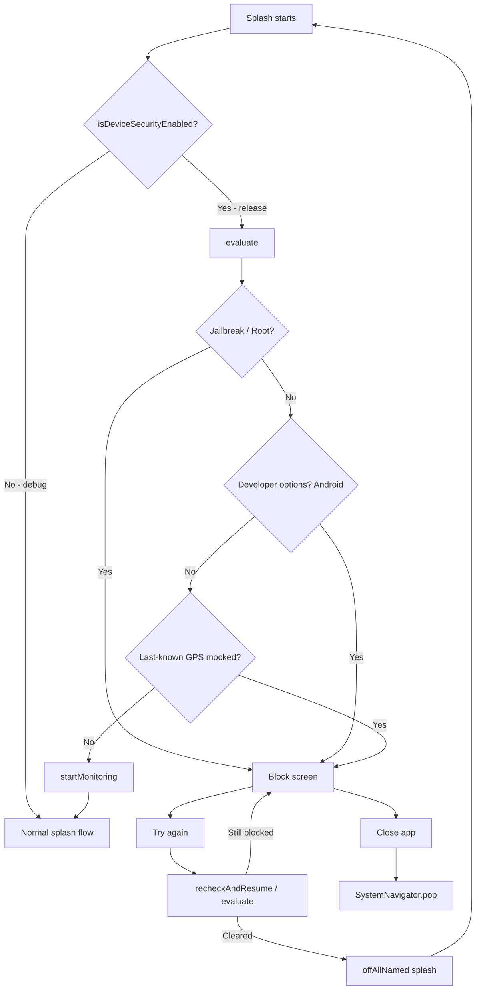

# Device security gate (release builds)

## Purpose

In **release** builds, Selcom Go blocks the app when the device looks compromised or configured for location / developer abuse:

| Threat | Meaning |
|--------|---------|
| Jailbreak / Root | Full system control (risky) |
| Developer options | Hidden testing settings (Android) |
| Mock location / Fake GPS | Spoofed GPS fix |
| Route spoofing | Spoofed movement path (same mock GPS signal) |

Debug builds never enforce this gate.

## Flag

```dart
// lib/core/services/device_security_service.dart
static const bool isDeviceSecurityEnabled = kReleaseMode;
```

| Build | `isDeviceSecurityEnabled` | Behaviour |
|-------|---------------------------|-----------|
| Release | `true` | Run checks; block on failure |
| Debug | `false` | Skip all checks |

## Key files

| File | Role |
|------|------|
| `lib/core/services/device_security_service.dart` | Integrity checks, monitoring, navigation to block screen |
| `lib/features/security/presentation/screens/device_security_blocked_screen.dart` | Themed block UI (Try again / Close app) |
| `lib/features/auth/presentation/screens/splash_screen.dart` | Runs gate before normal splash navigation |
| `lib/core/routes/app_routes.dart` | Route `deviceSecurityBlocked` |
| Localization (`AppStrings` + EN/SW) | All user-facing copy |

Dependency: `safe_device` (jailbreak/root + developer options). Mock GPS uses Geolocator **last-known** `Position.isMocked` only — SafeDevice’s built-in mock check is **disabled** so the system “improve location accuracy” dialog is not shown by this gate.

## Check order

Evaluations stop at the **first** failure:

1. **Jailbreak / Root** (`SafeDevice.isJailBroken`)
2. **Developer options** (Android only — `SafeDevice.isDevelopmentModeEnable`)
3. **Mock location** (last-known GPS with `isMocked == true`, only if location permission is already granted)

So if Developer options **and** Mock location are both on, the user sees the **Developer options** screen first. Mock location is checked only after developer options are off.

## Flow



### Splash

1. `enforceOrBlock()` runs `evaluate()`.
2. If blocked → navigate to `/device-security-blocked` and **do not** start monitoring.
3. If clear → `startMonitoring()` then continue splash (settings preload, auth routing).

### Block screen

- Shows localized title / subtitle / guidance for the failed `DeviceSecurityIssue`.
- **Try again** → `recheckAndResume()` (same check order; no location permission / accuracy prompts).
- **Close app** → exits the process.
- Back gesture is disabled (`PopScope(canPop: false)`).

### Monitoring

- Timer every **8 seconds** after the gate has passed.
- Skips while on the block screen.
- On failure → `stopMonitoring()` and open the block screen.

## Location behaviour (important)

This gate **must not**:

- Request location permission
- Call `Geolocator.getCurrentPosition`
- Use SafeDevice’s default mock-location listener (high-accuracy + settings dialog)

Mock detection only reads `Geolocator.getLastKnownPosition()` when permission is already `whileInUse` / `always`. If permission is denied, the mock/route check is skipped (fail open for that check).

## Localization keys

Prefix: `device_security_*` in `AppStrings`, `language_en.dart`, `language_sw.dart`.

Examples:

- `device_security_try_again` / `device_security_close_app`
- `device_security_developer_options_title` (+ `_subtitle`, `_guidance`)
- `device_security_mock_location_*`, `device_security_jailbreak_*`, `device_security_route_spoofing_*`

## Manual test plan

1. **Debug build** — enable developer options / mock GPS → app must **not** block.
2. **Release build** — enable Developer options → block screen for developer options.
3. Turn Developer options off → tap **Try again** → should continue (or next failure if mock GPS still mocked in last-known).
4. Confirm **no** “improve location accuracy” dialog from Try again.
5. Switch locale EN ↔ SW → copy updates on the block screen.
6. Tap **Close app** → process exits.

## Limits

Client-side detection is best-effort. Magisk Hide / advanced spoofing can bypass checks. Treat this as a UX / casual-abuse layer, not a hard security guarantee.
