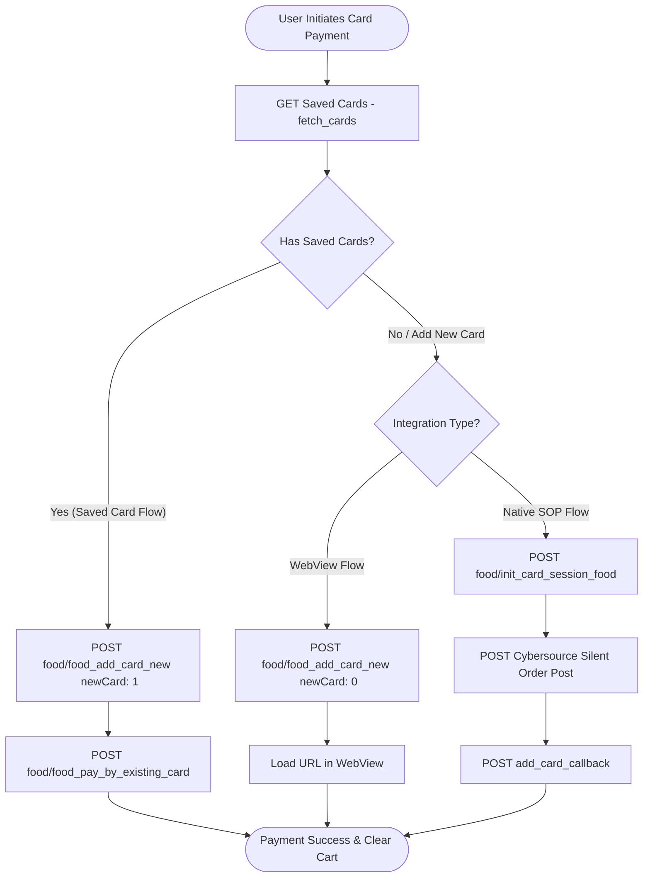

# Duka Direct - Food Module Card Integration API Documentation

This document describes the end-to-end integration flow and API endpoints for credit/debit card operations (adding, fetching, deleting, and paying with cards) specifically within the **Food Module** of the **Duka Direct** application.

---

## 1. Overview & Architecture (Food Module)

The card payment flow in the Food Module offers three methods of payment/linking:
1. **Hosted Checkout WebView (`food/food_add_card_new`)**: Used to initiate card payments or add new cards by opening a hosted checkout page inside a webview.
2. **Saved Card Charge (`food/food_pay_by_existing_card`)**: Charges a transaction using a pre-saved card token.
3. **Native Silent Order Post (SOP) (`food/init_card_session_food`)**: Used when collecting card inputs in-app via a native card entry form to generate a secure session directly with Cybersource, bypassing PCI-DSS scope.

### Process Flow Diagram (Food Module Card Actions)



---

## 2. Card Payment / Initialization (`food/food_add_card_new`)

Initiates the checkout or card addition session for the Food Module.

* **Endpoint:** `food/food_add_card_new`
* **Method:** `POST`
* **Purpose:** Creates the order session with the gateway and returns either a hosted payment URL (for webview flow) or session metadata (for saved card flow).

### Request Parameters
| Parameter Key | Type | Description |
| :--- | :--- | :--- |
| `sendAmount` | String | Amount to charge or verify (TZS) |
| `allCart_id` | Array of Strings | Active food cart item/order IDs |
| `type` | String | E.g. `"CARD"` |
| `newCard` | Integer | `0` = New Card webview checkout<br/>`1` = Saved card checkout |
| `transid` | String | Order session transaction ID |
| `deliveryCharge` | String / Numeric | Delivery charge amount |
| `billing_address_id` | String | Selected billing address ID |
| `isCheckout` | Boolean | `true` if initiated during checkout |
| `deliveryType` | String | Delivery type (e.g. `"DELIVERY"`) |
| `address_id` | String | Selected user delivery address ID |
| `promo_code` | String | Coupon or promotion code |
| `payment_mode` | String | Typically `"Mastercard/Visa"` |
| `delivery_date` | String | Scheduled delivery date (e.g. `"TODAY"`) |
| `delivery_option` | String | E.g. `"Standard_Delivery"` |
| `time_slot` | String | Scheduled delivery time slot |
| `order_id` | String | Order identifier (empty string if first check) |
| `starttime` | String | Start time |
| `endtime` | String | End time |
| `expresstime` | String | Express delivery time if applicable |
| `payment_token` | Integer | Payment token configuration (default `0`) |
| `weight` | String / Numeric | Cart weight |
| `sqr_amount` | String | Localized amount |
| `service_fees` | String / Numeric | Calculated service fee amount |
| `service_fees_list` | JSON String | Array of service fees applied |

#### Request Payload Example
```json
{
  "sendAmount": "12500",
  "allCart_id": ["cart_98765"],
  "type": "CARD",
  "newCard": 0,
  "deliveryCharge": "2000",
  "billing_address_id": "99",
  "transid": "TX_FOOD_77361",
  "isCheckout": true,
  "deliveryType": "DELIVERY",
  "address_id": "432",
  "promo_code": "",
  "payment_mode": "Mastercard/Visa",
  "delivery_date": "TODAY",
  "delivery_option": "Standard_Delivery",
  "time_slot": "12:00 PM - 01:00 PM",
  "order_id": "",
  "starttime": "12:00",
  "endtime": "13:00",
  "expresstime": "",
  "payment_token": 0,
  "weight": "1.2",
  "sqr_amount": "14500",
  "service_fees": "0",
  "service_fees_list": "[]"
}
```

#### Response Example
```json
{
  "status_code": 200,
  "message": "SUCCESS",
  "url": "https://pay.duka.direct/checkout/food/...",
  "transid": "TX_FOOD_77361"
}
```

---

## 3. Pay by Saved Card (`food/food_pay_by_existing_card`)

Executes a debit on a pre-saved card token for the food transaction.

* **Endpoint:** `food/food_pay_by_existing_card`
* **Method:** `POST`
* **Purpose:** Processes payment using a tokenized card and on success instructs the app to clear the local shopping cart.

### Request Parameters
| Parameter Key | Type | Description |
| :--- | :--- | :--- |
| `sendAmount` | Numeric | Net amount to charge |
| `deliveryCharge` | Numeric | Delivery charge amount |
| `transid` | String | Transaction ID from `food_add_card_new` |
| `card_token` | String | Selected token of the saved card |
| `sqr_amount` | Numeric | Total gross amount in TZS |

#### Request Payload Example
```json
{
  "sendAmount": 12500,
  "deliveryCharge": 2000,
  "transid": "TX_FOOD_77361",
  "card_token": "411111XXXXXX1111_TOKEN_ABC123",
  "sqr_amount": 14500
}
```

#### Response Example
```json
{
  "status_code": 200,
  "message": "Payment successful",
  "reference_number": "REF_FOOD_873910"
}
```

---

## 4. Native Card Session (`food/init_card_session_food`)

Initiates Cybersource Silent Order Post for native card collection forms inside the Food Module.

* **Endpoint:** `food/init_card_session_food`
* **Method:** `POST`
* **Purpose:** Returns signed session parameters needed to populate the HTML form submitted directly to Cybersource gateway.

#### Request Parameters
Includes all details from `food_add_card_new` plus AVS (Address Verification System) details and card metadata:
* `cardBin`: First 6 digits of card
* `email`: User billing email
* `mobile_number`: User billing mobile
* `country_code`: Country dial code
* `fname` / `lname`: Cardholder name
* `address` / `city` / `state` / `country` / `postalcode` / `country_name`: Billing location details
* `no_of_person` / `no_of_child`: Table/diners configuration if applicable

#### Request Payload Example
```json
{
  "sendAmount": "1000",
  "cardBin": "411111",
  "fname": "John",
  "lname": "Doe",
  "email": "user@example.com",
  "mobile_number": "712345678",
  "country_code": "+255",
  "address": "AVS Billing Street 1",
  "city": "Dar es Salaam",
  "state": "Dar",
  "country": "TZ",
  "postalcode": "00000",
  "country_name": "Tanzania"
}
```

#### Response Example
```json
{
  "status_code": 200,
  "transid": "TX_FOOD_77361",
  "data": [
    {
      "access_key": "YOUR_CYBERSOURCE_ACCESS_KEY",
      "profile_id": "YOUR_CYBERSOURCE_PROFILE_ID",
      "transaction_uuid": "e81d7f42-4f38-4e89-8d7b-99d9b4b0e512",
      "signed_field_names": "access_key,profile_id,transaction_uuid,signed_field_names,unsigned_field_names,signed_date_time,locale,transaction_type,reference_number,amount,currency,payment_method",
      "signature": "BASE64_GENERATED_SIGNATURE_FROM_BACKEND",
      "reference_number": "REF_982347209",
      "transaction_type": "create_payment_token",
      "payment_method": "card",
      "locale": "en",
      "currency": "TZS",
      "amount": "1000",
      "signed_date_time": "2026-07-08T12:00:00Z"
    }
  ]
}
```

---

## 5. Generic Card Management APIs (Used across Duka Direct)

The following endpoints manage the saved card library itself (called from account profile or checkout sheets):

### 1. Fetch Cards
* **Endpoint:** `fetch_cards`
* **Method:** `POST`
* **Request:** `{"type": "3"}`
* **Response:** Returns list of tokenized cards matching the user account:
  ```json
  {
    "status_code": 200,
    "message": "SUCCESS",
    "data": [
      {
        "id": 4810,
        "card_token": "411111XXXXXX1111_TOKEN_ABC123",
        "card_number": "XXXX-XXXX-XXXX-1111",
        "card_type": "Visa",
        "expiry_date": "12-2030",
        "name_on_card": "John Doe",
        "is_active": true
      }
    ]
  }
  ```

### 2. Delete Card
* **Endpoint:** `delete_card`
* **Method:** `POST`
* **Request:** `{"id": "4810"}`
* **Response:** `{"status_code": 200, "message": "Card deleted successfully"}`
