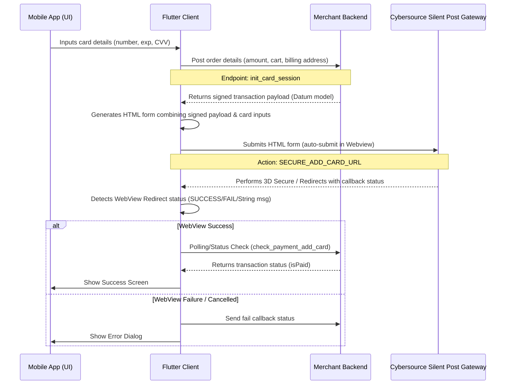

# Card Payment Integration Reference (Cybersource Silent Post)

This reference guide documents the credit/debit card payment flow via Cybersource Silent Post. This flow is based on the implementation of the **Food module** in the codebase.

---

## Architecture Overview

The integration uses a **Hybrid Silent Post** approach to protect PCI-DSS compliance by posting card details directly from the client's Webview to Cybersource, while signing the transaction details on the secure backend:



---

## Step-by-Step Implementation

### Step 1: Initialize the Card Session
Before sending card details, the client requests the merchant backend to create a signed transaction session. This prevents client-side tampering of the payment amount, currency, or merchant identifiers.

*   **HTTP Method**: `POST`
*   **Backend Endpoint**: `URLS.INIT_CARD_SESSION_FOOD` (or equivalent `init_card_session` endpoint)
*   **Request Headers**:
    ```http
    Authorization: Bearer <Access_Token>
    Content-Type: application/json
    ```
*   **Request Payload**:
    Contains transaction amount, billing address details, order/cart identifiers, and the card's BIN (first 6 digits).
*   **Response Payload (`InitSessionCardModel`)**:
    Returns the transaction status code, unique transaction reference, and a list of cryptographic parameters (Datum) signed by the backend:
    ```json
    {
      "status_code": 200,
      "message": "Session initialized",
      "transid": "TXN123456789",
      "data": [
        {
          "access_key": "YOUR_CYBERSOURCE_ACCESS_KEY",
          "profile_id": "YOUR_CYBERSOURCE_PROFILE_ID",
          "transaction_uuid": 987654321,
          "signed_field_names": "access_key,profile_id,transaction_uuid,signed_field_names,signed_date_time,locale,transaction_type,reference_number,amount,currency,payment_method",
          "signed_date_time": "2026-07-08T10:48:16Z",
          "signature": "BASE64_SIGNATURE_GENERATED_BY_BACKEND",
          "reference_number": "REF-98765",
          "amount": "1000.00",
          "currency": "TZS",
          "transaction_type": "sale",
          "payment_method": "card",
          "locale": "en",
          "bill_to_email": "user@example.com",
          "bill_to_forename": "John",
          "bill_to_surname": "Doe",
          "bill_to_phone": "+255712345678",
          "bill_to_address_line1": "123 Main St",
          "bill_to_address_city": "Dar es Salaam",
          "bill_to_address_country": "TZ"
        }
      ]
    }
    ```

---

### Step 2: Combine Signed Session & Card Data to Generate HTML
Combine the signed fields returned by the backend with the card information entered by the user. Generate an HTML page containing a form that posts directly to Cybersource's secure Silent Post URL.

*   **Cybersource Target URL**: `https://secureacceptance.cybersource.com/silent/pay`
*   **Card Inputs Formatting**:
    *   **Expiry Date format**: `MM-YYYY` (e.g. `12-2029`)
    *   **Card BIN**: First 6 digits of the card number.
    *   **Card Type Code mapping**:
        *   `Visa`: `001`
        *   `Mastercard`: `002`
        *   `Amex`: `003`

#### HTML Generator Method (Dart Reference)
```dart
String generateCybersourceFormHtml({
  required String cardNumber,
  required String expiryMonth,
  required String expiryYear,
  required String cvv,
  required String cardType,
  required Map<String, dynamic> sessionResponse,
}) {
  String htmlCode = '''
  <html>
    <body onload="document.f.submit();">
      <form id="f" name="f" method="post" action="https://secureacceptance.cybersource.com/silent/pay">
  ''';

  // Add all signed parameters returned by the backend
  sessionResponse.forEach((key, value) {
    htmlCode += '<input type="hidden" name="$key" value="$value" />\n';
  });

  // Append user-entered credit card fields
  htmlCode += '<input type="hidden" name="card_number" value="$cardNumber" />\n';
  htmlCode += '<input type="hidden" name="card_type" value="$cardType" />\n';
  htmlCode += '<input type="hidden" name="card_expiry_date" value="$expiryMonth-$expiryYear" />\n';
  htmlCode += '<input type="hidden" name="card_cvn" value="$cvv" />\n';

  htmlCode += '''
      </form>
    </body>
  </html>
  ''';

  return htmlCode;
}
```

---

### Step 3: Load HTML and Intercept WebView Redirects
Push the generated HTML code into a Flutter WebView (`CommonWebviewToLoadHTML`). The WebView will automatically execute the form post due to the body's `onload` event.

The WebView must monitor navigation changes to capture redirect URLs corresponding to transaction completion:
1.  **Success Condition**: If the webview lands on or redirects to a URL indicating success (e.g., matching the callback URL patterns), return `true` or a success flag.
2.  **Failure Condition**: If a redirection indicates a payment error (e.g., bad CVV, insufficient funds), extract the error message from the redirect parameters and return it as a `String`.
3.  **Cancellation Condition**: If the user dismisses the Webview before reaching a terminal landing page, return `null`.

#### WebView Navigation Handling Snippet
```dart
Navigator.push(
  context,
  MaterialPageRoute(
    builder: (context) => CommonWebviewToLoadHTML(htmlCode),
  ),
).then((isSuccess) async {
  if (isSuccess != null) {
    if (isSuccess is bool && isSuccess) {
      // Step 4: Verify Transaction Status
      openCheckOrderStatusAlert(sessionResponse.transid, context);
    } else if (isSuccess is String) {
      // Transaction failed with error message
      showErrorMessage(isSuccess);
      // Optional: notify backend about failure
      notifyBackendOfFailure(sessionResponse.transid);
    }
  } else {
    // User cancelled/closed the WebView
    notifyBackendOfFailure(sessionResponse.transid);
  }
});
```

---

### Step 4: Verify Order / Transaction Status
Do not rely exclusively on the client WebView redirect to confirm payments. When the WebView returns success, display a loading/polling overlay and poll your backend to check if the transaction is fully settled.

*   **API Endpoint**: `URLS.CHECK_PAYMENT_ADD_CARD` (or `check_payment_add_card` / `check_service_payment`)
*   **Body**:
    ```json
    {
      "transid": "<Session_Trans_ID>",
      "module": "Food"
    }
    ```
*   **Polling Logic**:
    *   Poll the status endpoint up to 5 times (with 1-2 second delays).
    *   If `isPaid` returns `true`, clear the client's shopping cart, pop checkout screens, and navigate to the order success/status screen.
    *   If it fails to verify within 5 attempts, display a connection error dialog and send a `"FAIL"` callback request to the backend.

---

## Best Practices & Gaps to Avoid

> [!IMPORTANT]
> **Callback Completeness**: Ensure that both SUCCESS and FAIL callback web service calls (`bill_add_card_callback` or equivalent) are executed. If the WebView fails or is closed manually by the user, the client must notify the backend of the `FAIL` state to release reserved stocks or expire the session immediately.

> [!WARNING]
> **Data Integrity Check**: Always validate the backend's session response data. Do not execute the WebView loader if `InitSessionCardModel.data` is empty or null, as this will lead to hard crashes on the client. Show an user-friendly initialization failure dialog instead.
